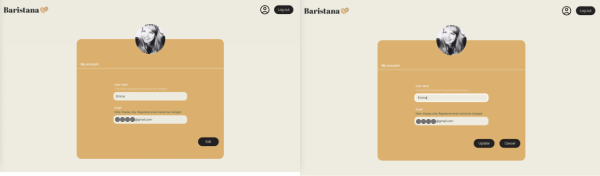

# Baristana


## Introduction

Baristana is a 'Virtual Café' that brings the café experience to your home. Designed with remote workers in mind, it offers a relaxing atmosphere and a casual interaction platform during work breaks. Key features include background music reminiscent of a café ambiance and a chat function. This project was a solo endeavor, allowing me to experience all stages of web application development.

## Table of Contents

- [Features](#features)
- [Getting Started](#getting-started)
- [Usage](#usage)
- [Technology Stack](#technology-stack)
- [Authors](#authors)

## Features

Baristana offers the following features:

Main Features
- Customizable Cafe BGM:
Enjoy your own BGM by adjusting three types of sound sources - cafe music, barista's working sound, and people's conversation.

- Chat Feature:
Following the concept of "Once-in-a-lifetime meeting," the conversation log is not retained. The conversation of active users in the chat is displayed only while participating in the chat. Emoji and file transmission functions are also included.

Additional Features
- Login: Users can securely log in using Google authentication.
- User Settings: You can set your username and display icon.

Each feature is designed with the user experience in mind, offering a unique  environment that mirrors the atmosphere of a real-life cafe.

## Getting Started

This application is built with Vue.js for frontend, Node.js and Express for backend, and MySQL for the database.

### Prerequisites

- Node.js version 16.0 or above
- Vue.js
- MySQL Server

### Installation

1. Clone the GitHub repository to your local machine.
```sh
git clone https://github.com/ydroal/Baristana.git
```

2. Navigate to the frontend directory (replace "frontend-directory" with the actual directory name) and install the required packages.
```sh
cd YOUR-REPOSITORY/frontend-directory
npm install
```
3. Do the same for the backend directory.
```sh
cd YOUR-REPOSITORY/backend-directory
npm install
```

### Database Setup

1. Install and configure a MySQL server, create a database, and set up a user with the necessary privileges.

2. Setup tables in your database　as shown below.
#### bgm

| Field | Type | Null | Key | Default | Extra |
|-------|------|------|-----|---------|-------|
| id | int | NO | PRI | NULL | auto_increment |
| file_url | varchar(255) | NO |  | NULL |  |
| title | varchar(255) | YES |  | NULL |  |
| artist | varchar(255) | YES |  | NULL |  |
| duration | float | YES |  | NULL |  |

#### user

| Field | Type | Null | Key | Default | Extra |
|-------|------|------|-----|---------|-------|
| id | int | NO | PRI | NULL | auto_increment |
| google_id | varchar(255) | NO | UNI | NULL |  |
| username | varchar(255) | NO |  | NULL |  |
| email | varchar(255) | NO | | NULL |  |
| profile_picture_url | varchar(255) | YES | | NULL |  |
| access_token | varchar(255) | YES | | NULL |  |
| created_at | datetime | NO | | NULL |  |
| refresh_token | varchar(255) | YES | | NULL |  |

#### active_user

| Field | Type | Null | Key | Default | Extra |
|-------|------|------|-----|---------|-------|
| id | int | NO | PRI | NULL | auto_increment |
| user_id | int | NO | UNI | NULL |  |
| last_activity | datetime | NO |  | NULL |  |
| chat_enabled | tinyint(1) | NO |  | 0 |  |

#### chat_message

| Field | Type | Null | Key | Default | Extra |
|-------|------|------|-----|---------|-------|
| id | int | NO | PRI | NULL | auto_increment |
| user_id | int | NO | MUL | NULL |  |
| message | text | NO |  | NULL |  |
| created_at | datetime | NO |  | NULL |  |

3. Set up the database connection using the following configuration but replace the credentials with your own. It's recommended to use environment variables for security purposes.  
*your can setting for environment variables: server/.env

```
const connection = mysql.createConnection({
  host: process.env.DB_HOST,
  user: process.env.DB_USER,
  password: process.env.DB_PASS,
  database: process.env.DB_NAME
});
```
Now, your application should be ready to run locally.


## Usage

Here's how to use the main features of Baristana:

### Cafe BGM Volume Sliders


After launching the application, you will find a panel to control the background music (BGM) on the main page. There are three types of sound sources: cafe music, barista's working sound, and people's conversation. Adjust the volume slider for each sound source according to your preference to create your own BGM.

### Chat Feature


To access the chat feature, click on the 'Chat' toggle button located in the index page. To use chat function, you need login. In the chat room, you can send messages, emojis, and files. Keep in mind that conversation logs are not retained and are visible only during your active participation in the chat.

### Login


Click on the 'Login' button in the navigation bar. You will be redirected to the Google authentication page. Enter your Google account credentials to log in.

### User Settings


To access user settings, click on the 'User Settings' icon in the navigation bar. Here, you can change your username and display icon with clicking edit button.

Remember to always click update button if you are sure the  changes before leaving the settings page.


These are the basic functionalities of the Baristana app.  
Explore and enjoy the virtual cafe atmosphere!

## Technology Stack

This project has been created using:

### Frontend:
- [Vue.js](https://vuejs.org/): The Progressive JavaScript Framework.
- [Vite](https://vitejs.dev/): A next-generation frontend build tool.

### Backend:
- [Node.js](https://nodejs.org/): An open-source, cross-platform JavaScript runtime environment.
- [Express](https://expressjs.com/): A fast, unopinionated, minimalist web framework for Node.js.

### Database:
- [MySQL](https://www.mysql.com/): An open-source relational database management system.

### Other Tools:
- [Vue CLI](https://cli.vuejs.org/): A full system for rapid Vue.js development.
- [NPM](https://www.npmjs.com/): A package manager for the JavaScript programming language.

For full list of dependencies, refer to `package.json`.

## Authors

**Yoko ONO**
- GitHub: [ydroal](https://github.com/ydroal)